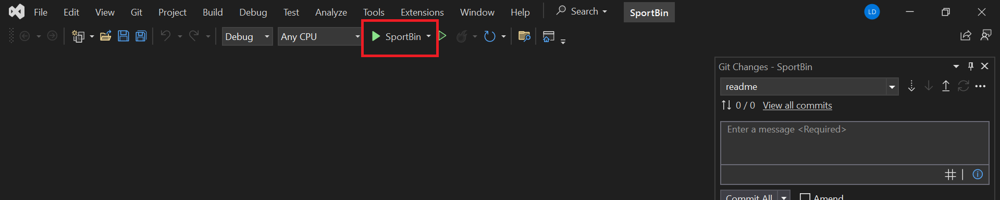

<div align="center">
<pre>
███████╗██████╗  ██████╗ ██████╗ ████████╗██████╗ ██╗███╗   ██╗
██╔════╝██╔══██╗██╔═══██╗██╔══██╗╚══██╔══╝██╔══██╗██║████╗  ██║
███████╗██████╔╝██║   ██║██████╔╝   ██║   ██████╔╝██║██╔██╗ ██║
╚════██║██╔═══╝ ██║   ██║██╔══██╗   ██║   ██╔══██╗██║██║╚██╗██║
███████║██║     ╚██████╔╝██║  ██║   ██║   ██████╔╝██║██║ ╚████║
╚══════╝╚═╝      ╚═════╝ ╚═╝  ╚═╝   ╚═╝   ╚═════╝ ╚═╝╚═╝  ╚═══
---------------------------------------------------
results of sport events web application
</pre>
</div>

Do you need all your sport event results in one place? SportBin provides insight into results for all types of sporting events in a simple and easy to use web application.

## How to start the application

### Visit in the browser

To visit the application in the browser, go to [https://sportbinserver.azurewebsites.net/](https://sportbinserver.azurewebsites.net/)

### Start locally

To start the application locally, follow these instructions:

1. Download and install node.js from [https://nodejs.org/en](https://nodejs.org/en)
2. Clone the project
3. In the terminal, navigate to ..\SportBin\ClientApp
4. In the terminal, type the following command
   ```sh
   npm i
   ```
5. Open the SportBin.snl file
6. In Visual Studio, click on the green start button labeled 'SportBin'
   

## How to log in

1. Navigate to the login page by clicking on the 'Login' button in the app header
2. Fill in admin credentials
   Email adresa: 'admin@admin.com'
   Lozinka: 'admin123'
3. Click the Login button, and then click Ok on the popup window

## Meta

This application was developed as a part of a university course assignment.
